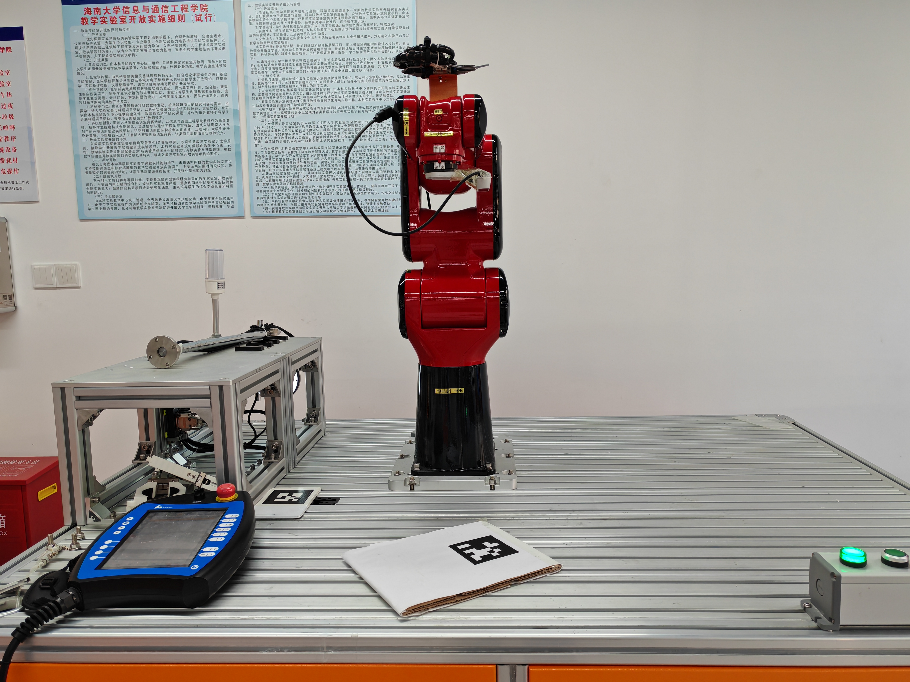
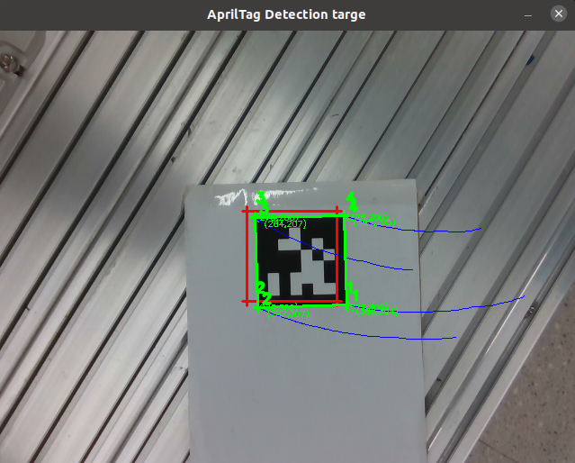
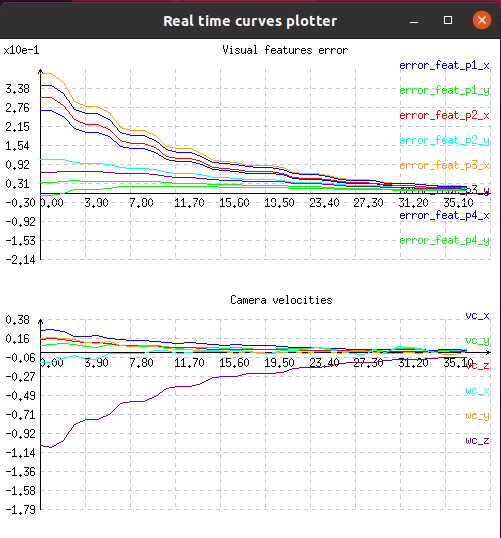

# IBVS_with_OMCS_OTG

A ROS (Robot Operating System) package for **Image-Based Visual Servoing (IBVS)** integrated with **Ruckig Online Trajectory Generation (OTG)** for the JR603 robotic arm. This package implements real-time control, trajectory planning, and visual servoing functionalities, with support for AprilTag detection, EtherCAT communication, and PID control.

## Table of Contents

- [Overview](https://www.doubao.com/chat/32685523799798274#overview)
- [Dependencies](https://www.doubao.com/chat/32685523799798274#dependencies)
- [Package Structure](https://www.doubao.com/chat/32685523799798274#package-structure)
- [Getting Started](https://www.doubao.com/chat/32685523799798274#getting-started)
- [Key Features](https://www.doubao.com/chat/32685523799798274#key-features)
- [Experimental Tests](https://www.doubao.com/chat/32685523799798274#experimental-tests)
- [Launch Files](https://www.doubao.com/chat/32685523799798274#launch-files)
- [Custom Messages/Services](https://www.doubao.com/chat/32685523799798274#custom-messages-services)
- [License](https://www.doubao.com/chat/32685523799798274#license)

## Overview

This package is designed for the JR603 6-degree-of-freedom (DoF) robotic arm, focusing on IBVS-based control with smooth trajectory generation using the Ruckig OTG library. It includes modules for kinematics (forward/inverse), visual feature detection (AprilTag), EtherCAT-based motion control, and PID tuning, enabling flexible and precise robotic arm operation.

## Dependencies

- ROS Noetic (Ubuntu 20.04) / Melodic (Ubuntu 18.04)
- [Ruckig](https://github.com/pantor/ruckig) (OTG library for trajectory generation)
- [ViSP](https://visp.inria.fr/) (Visual Servoing Platform)
- OpenCV (for image processing and AprilTag detection)
- Python 3 (for scripting and kinematics calculations)
- EtherCAT communication libraries (for JR603 hardware interface)
- `geometry_msgs`, `sensor_msgs`, `std_msgs` (standard ROS message packages)

## Package Structure

```plaintext
IBVS_with_Ruckig_OTG/
├── CMakeLists.txt          # Build configuration
├── LICENSE                 # License information
├── README.md               # Project documentation
├── docs/                   # Documentation resources
│   └── images/             # Experimental test images
├── include/lys_visp_demo/  # Header files for C++ modules
├── launch/                 # ROS launch files for quick execution
├── msg/                    # Custom ROS message definitions
├── package.xml             # ROS package metadata and dependencies
├── scripts/                # Python scripts for kinematics, detection, and control
│   └── lys_python_sdk/     # Custom Python SDK for JR603 control
├── src/                    # C++ source files for IBVS, OTG, and hardware interface
└── srv/                    # Custom ROS service definitions
```

## Getting Started

### 1. Clone the Repository

```bash
cd ~/catkin_ws/src
git clone https://github.com/rfedsc/IBVS_with_Ruckig_OTG.git
cd .. && catkin_make
source devel/setup.bash
```

### 2. Install Dependencies

```bash
# Install ROS dependencies
rosdep install --from-paths src --ignore-src -r -y

# Install Ruckig (follow official instructions: https://github.com/pantor/ruckig)
# Install ViSP (sudo apt-get install ros-noetic-visp)
```

### 3. Run a Launch File

```bash
roslaunch IBVS_with_Ruckig_OTG jr603_ibvs_pos_with_ruckig_socket.launch
```

## Key Features

- **Image-Based Visual Servoing (IBVS)**: Implements IBVS control loop using ViSP, with visual features from AprilTag markers.
- **Ruckig OTG Integration**: Generates smooth trajectories for position/velocity control of the JR603 arm, minimizing jerk and ensuring safety.
- **Kinematics Calculations**: Forward (FK) and inverse (IK) kinematics for 6DoF robotic arm (JR603) in Python/C++.
- **EtherCAT Communication**: Low-latency hardware interface for JR603 arm control via EtherCAT.
- **AprilTag Detection**: Real-time detection of AprilTag markers for visual servoing targets.
- **PID Control**: Configurable PID controllers for joint velocity/position regulation.
- **Modular Design**: Separated modules for kinematics, control, and vision for easy extension.

## Experimental Tests

This section presents the experimental platform and test results of the IBVS visual servoing for the JR603 robotic arm, verifying the performance of Ruckig OTG trajectory optimization and IBVS closed-loop control.

### 1. Experimental Platform

The test platform consists of the JR603 6DoF robotic arm, an industrial camera, an AprilTag calibration board, and a host computer running ROS. The hardware connection and deployment are shown below:



### 2. Visual Servoing Trajectory

The following figure shows the visual trajectory tracking effect of the robotic arm end-effector during IBVS control. The trajectory is calculated based on the feature points of the detected AprilTag markers, reflecting the real-time response of the closed-loop control system:



### 3. Velocity and Error Curves

The curves below display the camera velocity response and visual error convergence during the experiment. It can be observed that the Ruckig OTG library effectively optimizes the motion process, reducing the system's jerk and enabling the visual error to converge stably to the target range:



## Launch Files

The `launch/` directory contains pre-configured launch files for common use cases:

- `jr603_ibvs_pos_socket.launch`: IBVS position control via socket communication.
- `jr603_ibvs_pos_with_ruckig_socket.launch`: IBVS position control with Ruckig OTG.
- `jr603_ibvs_test.launch`: Basic IBVS functionality test.
- `jr603_pid_test.launch`: PID controller tuning and testing.
- `jr603_velocity_ethercatV0.launch`: Velocity control via EtherCAT (V0).
- `jr603_velocity_with_ruckig_etharcatV0.launch`: Velocity control with Ruckig OTG via EtherCAT (V0).

## Custom Messages/Services

### Messages (`msg/`)

- `AprilTagCorners.msg`: Stores corner coordinates of detected AprilTag markers.
- `HomogeneousTransform.msg`: Represents a 4x4 homogeneous transformation matrix (for pose representation).
- `PixelCoordinates.msg`: 2D pixel coordinates of visual features (e.g., AprilTag centers).

### Services (`srv/`)

- `SendCommand.srv`: Custom service for sending motion commands to the JR603 arm (e.g., joint angles, target pose).

## License

This project is licensed under the [MIT License](https://www.doubao.com/chat/LICENSE) - see the LICENSE file for details.

------

*For hardware-specific setup (e.g., JR603 EtherCAT configuration) or troubleshooting, refer to the JR603 robotic arm's official documentation.*
